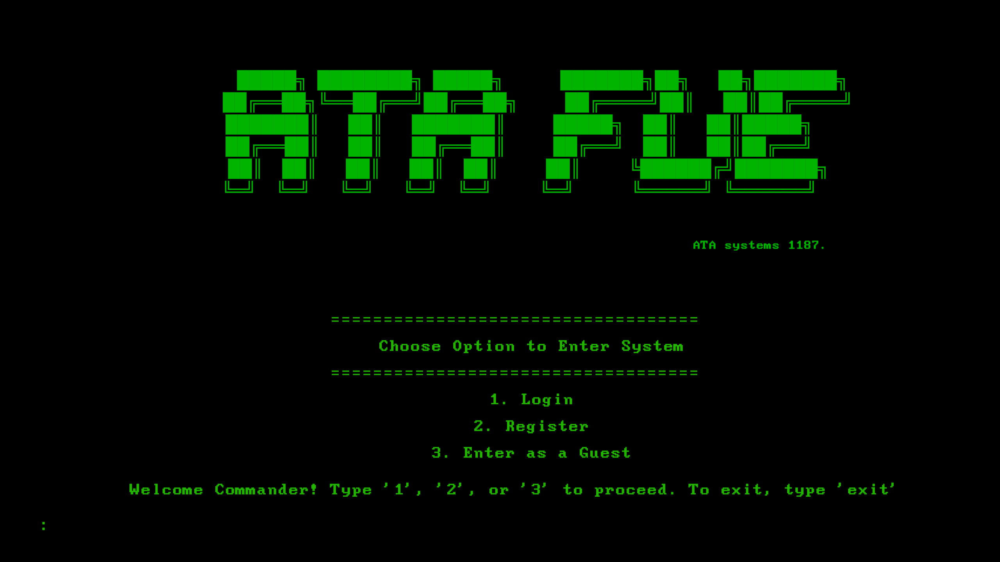
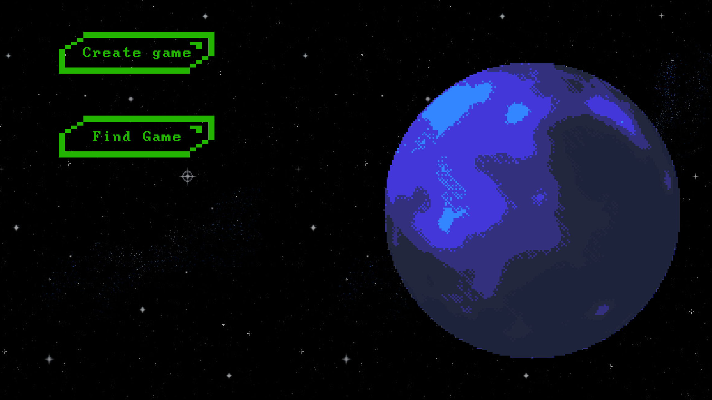
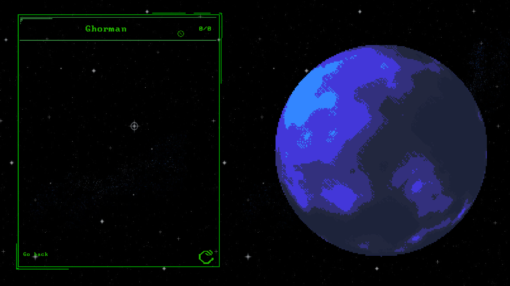
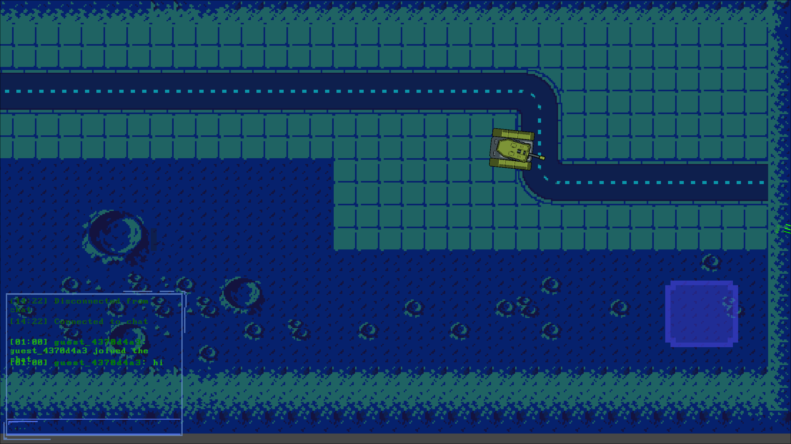
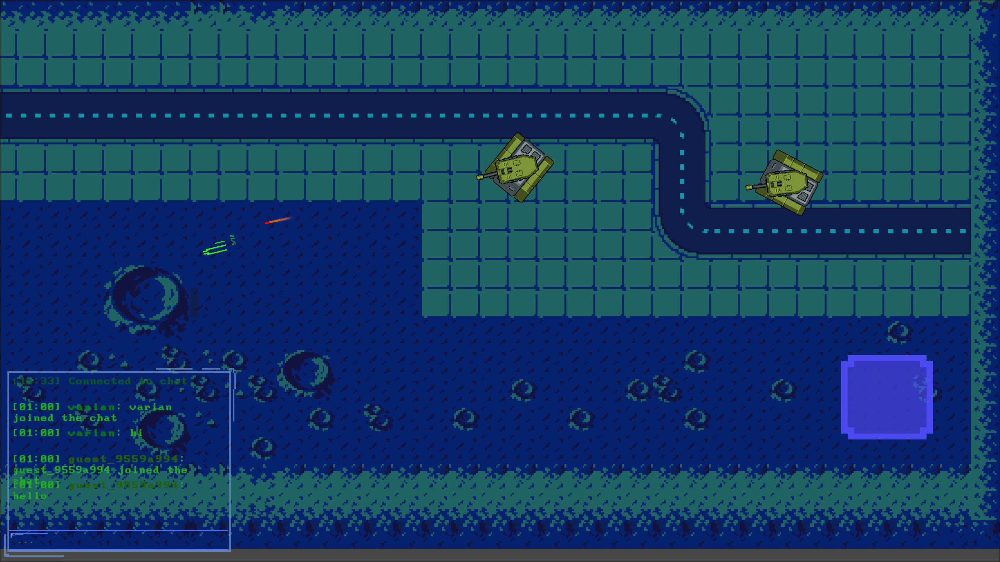

# ATA Systems

A cooperative PVE tower defense bullet hell game built in Unity, featuring multiplayer functionality via a Spring Boot bacekend.

## Game Overview

Tanks-Online (ATA Systems) is a challenging multiplayer game where players control tanks in an 80s sci-fi military environment inspired by classics like Patlabor and Aliens. Players must cooperatively defend against waves of enemies by placing towers strategically while also avoiding direct attacks from mobs.

Work together with other players to:
- Defend against waves of enemy attackers
- Place and upgrade defensive towers strategically
- Control your tank to directly engage with enemies
- Survive increasingly difficult challenges

## Gameplay Concept

Players will:
- Control unique tanks with different abilities
- Strategically place defense towers to fend off enemy waves
- Coordinate with teammates to survive increasingly difficult encounters
- Manage resources and upgrade paths for both tanks and towers
- Navigate environmental hazards while battling enemies

## Visual Style

The game features a pixel art aesthetic with an 80s sci-fi military vibe, featuring:
- Retro-futuristic tanks and defense systems
- Detailed pixel art tanks and environments
- Moody, atmospheric environments
- Retro-futuristic UI elements
- Nostalgic visual cues reminiscent of classic sci-fi military media

## Current Development Status

This project is in early development, with the following features implemented:
- Player authentication
- Basic tank movement and controls
- Real-time chat functionality
- Game session management
- Multiplayer connection infrastructure
- Test the game by downloading the build (linux/windows) from [TanksGame](/TanksGame/builds) and starting the backend service

## Game Assets

The project utilizes several asset packs to achieve its distinctive look:
- Robot Warfare Asset Pack
- Ground Shaker Assets
- Planet Generator
- Custom pixel art elements

## Technical Requirements

- Unity 2022.3 or newer
- .NET Framework compatible with Unity

## Getting Started
To run the game, follow these steps:
1. Download the latest build from the [TanksGame builds](/TanksGame/builds) directory.
2. Ensure the backend service is running (see [backend README](/tanks_backend/README.md)).
3. Launch the game.

## Setup for Development

1. Clone the repository
2. Open the project in Unity
3. Ensure the backend service is running (see [backend README](/tanks_backend/README.md))
4. Open and play the main scene

## Whats next?

- Create system for placing and upgrading towers
- Implement enemy AI behaviors
- Resource management
- Varied enemy types with different behaviors

## Screenshots

## Contributing

This project is primarily a learning exercise, but suggestions and feedback are welcome through the issue tracker.

## License

This project includes third-party assets that have their own licensing terms. The custom code is licensed under the Apache License 2.0.
